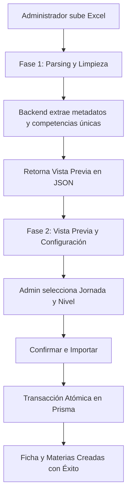

# Proceso de Importación de Fichas y Materias desde Excel

Este documento detalla el diseño, la lógica de negocio y el flujo técnico implementados para la importación masiva de fichas de caracterización y materias asociadas en la plataforma **Arachiz**.

---

## 🛠️ Arquitectura del Proceso

El flujo está diseñado en **dos fases** para prevenir la creación de registros incorrectos y permitir la asignación manual de campos no presentes en el archivo Excel:

---

## 📋 Reglas de Limpieza y Extracción de Datos

Según los requerimientos detallados en [CAMPOS_IMPORTACION.md](file:///c:/Users/contr/OneDrive/Documentos/Arachiz-inc/CAMPOS_IMPORTACION.md), la extracción aplica las siguientes transformaciones de datos:

1. **Regional (Celda `C11`)**:
   * Entrada: `"73 - REGIONAL TOLIMA"`
   * Lógica: Expresión regular que remueve números iniciales y guiones (`/^\d+\s*[-–—]\s*/`).
   * Salida: `"REGIONAL TOLIMA"`

2. **Centro de Formación (Celda `C12`)**:
   * Limpieza del código numérico inicial en caso de existir (ej. `"9226 - CENTRO..."` -> `"CENTRO..."`).

3. **Competencias / Materias (Columna `F`, Fila `14` en adelante)**:
   * Entrada: `"220501006 - DESARROLLO DE SOFTWARE"`
   * Lógica: Se descartan códigos numéricos de competencia y se remueven duplicados mediante un `Set`.
   * Salida: `"DESARROLLO DE SOFTWARE"` (Materia única).

4. **Fechas (Celdas `C8` e `C9`)**:
   * Admite objetos `Date` nativos de Excel o formatos de cadena (`DD/MM/YYYY`, `YYYY-MM-DD`).
   * Calcula de forma automática la **Duración** en meses (máximo 30 meses) restando ambas fechas.

---

## 🔌 Rutas del API y Middleware

Se habilitaron dos endpoints en [importRoutes.js](file:///c:/Users/contr/OneDrive/Documentos/Arachiz-inc/backend/routes/importRoutes.js) protegidos bajo el middleware `isAdministrador`:

* **`POST /api/import/excel-ficha/parse`**:
  * Recibe un archivo Excel usando `uploadMiddleware`.
  * Parsea y retorna los datos estructurados en un formato JSON listo para el frontend.
* **`POST /api/import/excel-ficha/confirm`**:
  * Recibe los metadatos confirmados por el usuario y la lista de materias.
  * Realiza una operación atómica (`$transaction`) para crear la `Ficha`, conectar al `Administrador` como líder y registrar las materias.

---

## 🎨 Interfaz de Usuario (Frontend)

* Se encuentra integrada en el panel del administrador (`/admin/fichas`).
* Cuenta con un **modal premium** que proporciona retroalimentación instantánea sobre el archivo seleccionado y la información extraída.
* Permite seleccionar dinámicamente la **Jornada** y el **Nivel de formación**.
