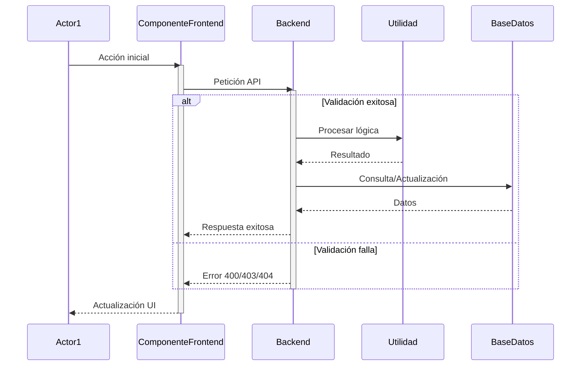
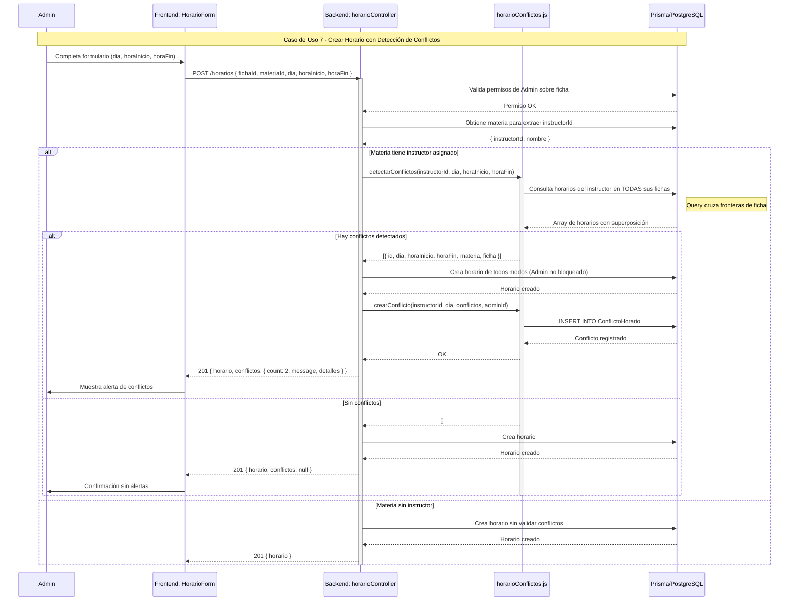

# PROMPT PARA GEMINI: Diagramas de Secuencia

---

## INSTRUCCIONES PARA GEMINI

Eres un arquitecto de software especializado en diagramas UML. Tu tarea es **crear diagramas de secuencia detallados** en formato **Mermaid** para los dos casos de uso que te proporcionaré.

---

## REQUERIMIENTOS GENERALES

1. **Formato:** Usa sintaxis Mermaid para diagramas de secuencia (`sequenceDiagram`)

2. **Actores:** Identifica claramente los actores principales y secundarios de cada caso de uso

3. **Objetos del sistema:** Incluye los componentes clave mencionados en la sección "Tecnologías" de cada caso de uso:
   - Frontend (componentes React específicos)
   - Backend (controladores, servicios)
   - Base de datos (Prisma/PostgreSQL)
   - Utilidades (utils)

4. **Flujo principal:** Dibuja el flujo principal completo con todas las interacciones

5. **Flujos alternativos:** Usa bloques `alt`, `opt` y `loop` de Mermaid para representar:
   - Validaciones que pueden fallar
   - Decisiones condicionales
   - Manejo de errores
   - Casos especiales mencionados en "Flujos Alternativos"

6. **Notas explicativas:** Usa `Note over` o `Note right/left of` para agregar detalles técnicos importantes mencionados en "Requerimientos Especiales"

7. **Activaciones:** Usa `activate`/`deactivate` para mostrar cuando un componente está procesando

8. **Respuestas:** Muestra claramente las respuestas exitosas y de error entre componentes

---

## ESTRUCTURA ESPERADA PARA CADA DIAGRAMA

---

## DIAGRAMA 1: Caso de Uso 7 - Detectar y Gestionar Conflictos de Horario

**Actores a incluir:**
- Administrador
- Instructor

**Componentes a incluir:**
- Frontend: Modal/Formulario de creación de horario
- Backend: `horarioController.js`, `adminController.js`
- Utilidad: `horarioConflictos.js` (funciones `detectarConflictos`, `crearConflicto`, `resolverConflicto`)
- Base de datos: Prisma (tablas `Horario`, `ConflictoHorario`, `Materia`)

**Flujos a representar:**

### Flujo Principal (Administrador crea horario):
1. Admin envía datos de horario (fichaId, materiaId, dia, horaInicio, horaFin)
2. Backend valida permisos
3. Backend consulta materia para obtener instructorId
4. Backend llama a `detectarConflictos(instructorId, dia, horaInicio, horaFin)`
5. Utilidad consulta horarios existentes del instructor en TODAS sus fichas
6. Si hay conflictos:
   - Backend crea horario de todos modos (no bloquea)
   - Backend llama a `crearConflicto(instructorId, dia, conflictos, adminId)`
   - BD crea registro en tabla `ConflictoHorario`
   - Backend retorna respuesta con campo `conflictos: { count, message, detalles }`
7. Frontend muestra alerta con conflictos detectados

### Flujos Alternativos a representar:

**Alt 1: Instructor intenta crear horario con conflicto**
- Backend detecta conflictos
- Backend RECHAZA con error 400
- Frontend muestra mensaje de error detallado

**Alt 2: Admin elimina horario conflictivo**
- Backend elimina horario
- Backend llama a `detectarConflictos` para ese instructor/día
- Si ya no hay conflictos, marca automáticamente como resueltos en BD
- Frontend actualiza vista

**Alt 3: Instructor marca conflicto como resuelto**
- Instructor envía PUT a `/horarios/conflictos/:id/resolver`
- Backend valida que el conflicto pertenece al instructor
- Backend actualiza `resuelto: true` y `resolvedAt`
- Frontend muestra confirmación

---

## DIAGRAMA 2: Caso de Uso 8 - Registrar Asistencia por Reconocimiento Facial

**Actores a incluir:**
- Instructor
- Aprendiz (participa pasivamente presentándose ante la cámara)

**Componentes a incluir:**
- Frontend: `FacialScanner.jsx`, `faceApi.js`
- Librería: face-api.js (modelos en `/public/models/`)
- Backend: `asistenciaController.js` (endpoint `/asistencias/facial-register`)
- Base de datos: Prisma (tablas `User`, `RegistroAsistencia`)

**Flujos a representar:**

### Flujo Principal (Escáner continuo automático):
1. Instructor hace clic en "Iniciar Escáner"
2. Frontend activa cámara (`navigator.mediaDevices.getUserMedia`)
3. Frontend carga modelos face-api.js desde `/public/models/`
4. Frontend inicia loop de detección (~3 fps):
   - Captura frame del video
   - face-api.js detecta todos los rostros (`detectAllFaces`)
   - face-api.js extrae descriptores faciales (Float[128])
5. Frontend consulta aprendices de la ficha con `faceDescriptor` registrado
6. Para cada rostro detectado:
   - Calcula distancia euclidiana con todos los descriptores almacenados
   - Si distancia < 0.55 → identifica aprendiz
   - Verifica que NO esté en cooldown (5s) ni ya registrado
   - Frontend muestra nombre en overlay INSTANTÁNEAMENTE (verde si nuevo, azul si ya registrado)
7. Si es nuevo registro:
   - Frontend envía POST a `/asistencias/facial-register` EN SEGUNDO PLANO
   - Backend valida que no exista registro duplicado
   - Backend crea `RegistroAsistencia` con método "facial"
   - Backend calcula si llegó tarde según `llegadaTarde`
   - Backend retorna confirmación
   - Frontend actualiza contador y agrega a historial visible
8. Loop continúa hasta que instructor hace clic en "Detener"

### Flujos Alternativos a representar:

**Alt 1: No se detecta ningún rostro**
- face-api.js retorna array vacío
- Frontend no muestra overlay
- Loop continúa sin registrar nada

**Alt 2: Rostro no reconocido (distancia >= 0.55)**
- Frontend no muestra nombre
- No se envía petición al backend
- Loop continúa

**Alt 3: Aprendiz ya tiene registro en la sesión**
- Frontend detecta ID en `registeredRef.current`
- Muestra overlay azul "Ya marcado" pero NO envía a backend
- Aprendiz entra en cooldown de 5s

**Alt 4: Error al cargar modelos face-api.js**
- Frontend captura error en `loadFaceModels()`
- Muestra mensaje de error en UI
- Deshabilita botón de escáner
- Sugiere usar otro método

**Alt 5: Enrollar descriptor facial (flujo separado)**
- Aprendiz/Instructor abre modal "Registrar Cara"
- Frontend activa cámara
- face-api.js captura rostro con `detectSingleFace`
- Extrae descriptor Float[128]
- Envía POST a `/auth/face-descriptor` o `/auth/face-descriptor-for/:userId`
- Backend guarda en campo `faceDescriptor` del usuario
- Frontend muestra confirmación

---

## NOTAS IMPORTANTES PARA LOS DIAGRAMAS

### Para Caso de Uso 7:
- Enfatiza que los conflictos se detectan en **TODAS las fichas** del instructor (query cruza fronteras de ficha)
- Muestra claramente la diferencia entre Admin (puede crear conflictos) vs Instructor (es bloqueado)
- Incluye la estructura JSON de la respuesta con conflictos: `{ count, message, detalles }`

### Para Caso de Uso 8:
- Usa un bloque `loop` para el ciclo continuo de detección (~3 fps)
- Marca claramente que la comparación de descriptores es en **frontend** (para velocidad) pero el registro es en **backend** (para integridad)
- Usa `par` (parallel) para mostrar que el envío al backend es asíncrono mientras el loop continúa
- Incluye nota sobre el cooldown de 5 segundos y el umbral de 0.55
- Muestra que el frontend actualiza UI instantáneamente sin esperar respuesta del backend

---

## FORMATO DE SALIDA

Por favor genera **DOS diagramas de secuencia en bloques de código Mermaid separados**, uno para cada caso de uso. Cada diagrama debe:

1. Tener título claro
2. Incluir todos los participantes mencionados
3. Representar el flujo principal completo
4. Incluir al menos 3 flujos alternativos significativos
5. Usar bloques `alt`, `opt`, `loop`, `par` según corresponda
6. Incluir notas técnicas relevantes de los "Requerimientos Especiales"

---

## EJEMPLO DE CALIDAD ESPERADA

---

**POR FAVOR GENERA LOS DOS DIAGRAMAS AHORA.**
