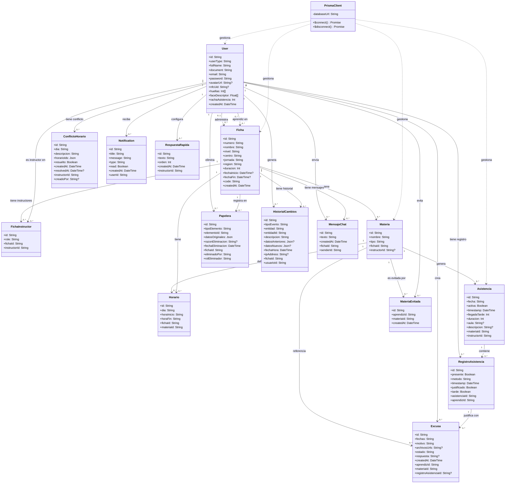

# Diagrama de Clases — Arachiz Inc

> **Nota arquitectónica:** El proyecto usa **Node.js + Prisma ORM**.  
> No existen clases Model propias. Los modelos se definen en `schema.prisma` y Prisma genera
> automáticamente todos los métodos de acceso a datos (`findMany`, `create`, `update`, `delete`, etc.).  
> Los controladores consumen directamente el singleton de `PrismaClient` exportado desde `lib/prisma.js`.  
> Por esto, las clases del diagrama aparecen **sin métodos** — esa es la representación correcta para un ORM.

